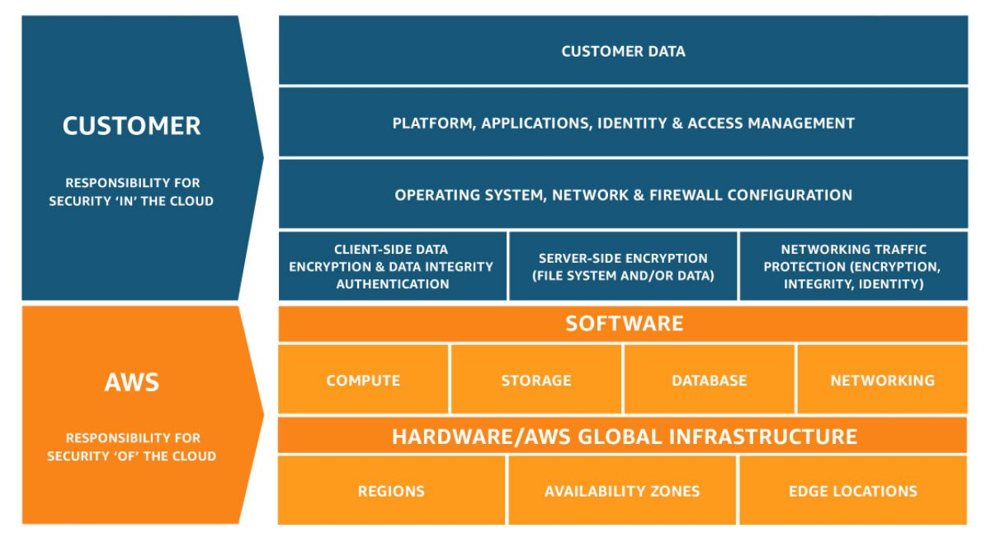
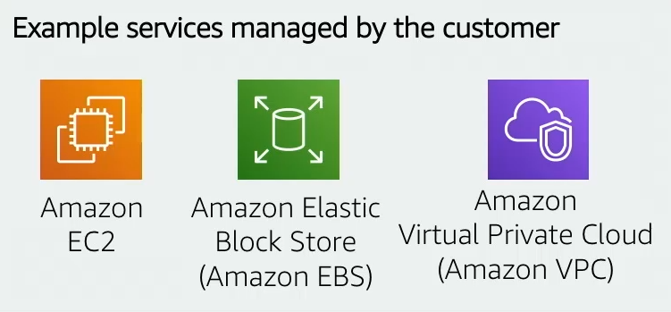
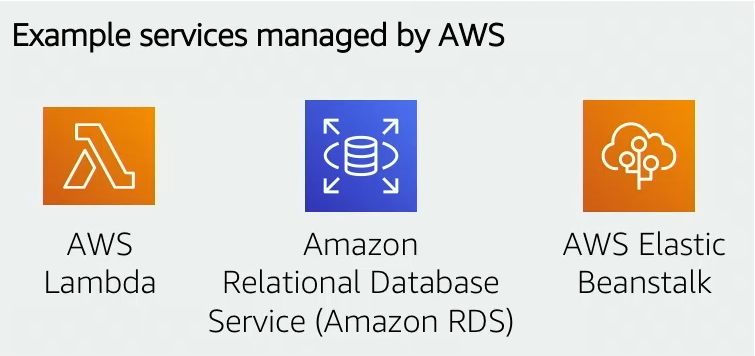
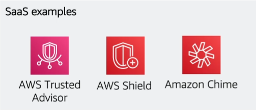
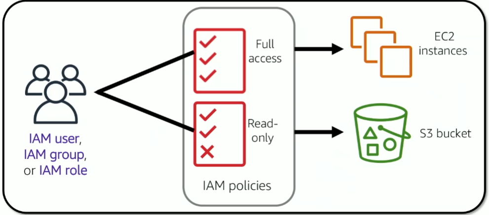
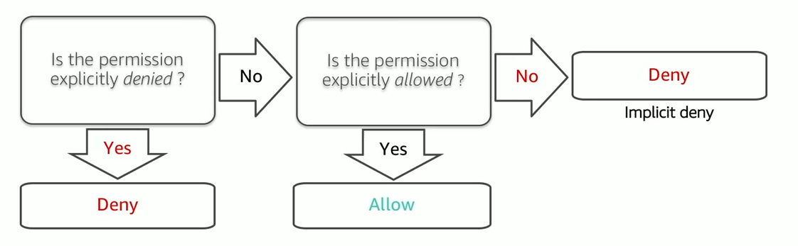
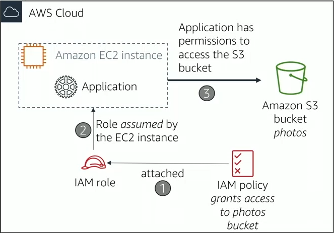
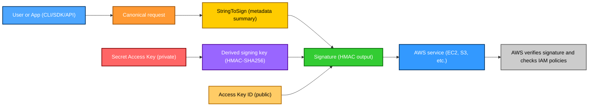

# AWS Shallow Dive

## 1. What is Cloud Computing?
Cloud computing is the delivery of computing services (servers, storage, databases, networking, software, analytics, intelligence) over the internet (“the cloud”).  
Instead of owning physical servers or data centers, companies rent computing resources from providers like AWS.

### Why use Cloud instead of Local Infrastructure?
- **Scalability** – Easily scale up or down as needed.
- **Cost efficiency** – Pay only for what you use (no large upfront hardware costs).
- **Accessibility** – Access from anywhere with internet.
- **Reliability** – Built-in redundancy and failover.
- **Security** – Enterprise-level security measures.
- **Faster deployment** – Launch resources in minutes.

### AWS responsibilty model



### Key AWS structures

## Key AWS Structures (with ARN examples)

### Regions & Availability Zones (AZs)
- **Region** = a geographic cluster of AWS data centers (e.g., `us-east-1`, `eu-central-1`).
- **Physically**: each Region contains **multiple AZs**; each AZ is an isolated data center or campus with separate power, cooling, and networking.
- **Why it matters**: place workloads near users (low latency) and keep data in-country (compliance). Design for HA by spreading across **≥2 AZs**.

### Accounts, “Projects”, and Subscriptions
- **AWS Account** = isolation + billing boundary + IAM scope. Use multiple accounts for envs (prod/stage/dev), teams, or tenants.
- **“Project”** (not an AWS primitive): organize via **tags**, **OUs** (AWS Organizations), and sometimes **separate accounts** per project.
- **“Subscription”** is an **Azure** term. In AWS the closest equivalent is an **Account**.
- **Organizations**: link accounts, apply guardrails (SCPs), and use **Consolidated Billing**.

### Billing (how you pay)
- **Pay-as-you-go** for usage (compute hours, GB-months, requests, egress).
- **Discounts**: **Savings Plans/Reserved Instances** for steady workloads.
- **Free Tier** for testing; **Budgets** and **Cost Explorer** to track/alert.
- **Consolidated Billing** rolls up costs across linked accounts.

---

## ARN (Amazon Resource Name)

**What it is**  
A **globally unique identifier** for any AWS resource.

**Generic format**  
arn:partition:service:region:account-id:resource


**Field breakdown:**
- **`arn`** – indicates that this is an Amazon Resource Name.
- **`service`** – AWS service namespace (e.g., `ec2`, `s3`, `lambda`, `dynamodb`); in the example, `ec2` is for an EC2 server.
- **`region`** – the geographic location where the resource resides (e.g., `us-west-2`); AWS divides its infrastructure into regions for accessibility and faster performance.
- **`account-id`** – the 12-digit AWS account ID that owns the resource.
- **`resource`** – a service-specific path or unique ID; could represent an EC2 instance, an object in S3, a Lambda function, or a database record.

**Examples:**
arn:aws:ec2:us-west-2:123456789012:instance/i-1234567890abcdef0
arn:aws:s3:::my-bucket/my-object
arn:aws:lambda:us-east-1:123456789012:function:MyFunction
arn:aws:dynamodb:us-east-1:123456789012:table/MyTable

---


## 2. Cloud Service Models

### **IaaS** – Infrastructure as a Service
- Provides virtualized computing resources over the internet.
- Examples: AWS EC2, Amazon VPC.
- You manage: OS, applications, runtime.
- AWS manages: hardware, networking.



AWS provides raw infrastructure resources, and you manage the operating systems, networking, and software:
- **Amazon EC2** – Virtual servers you manage.
- **Amazon EBS** – Block storage volumes for EC2 instances.
- **Amazon VPC** – Isolated virtual network environment in AWS.

### **PaaS** – Platform as a Service
- Provides platform and environment to build apps without managing infrastructure.
- Examples: AWS Elastic Beanstalk, AWS Lambda.
- You focus on code, AWS handles infrastructure.



Services where AWS manages the underlying infrastructure, and you focus on code or application logic:
- **AWS Lambda** – Run code without managing servers (serverless).
- **Amazon RDS** – Managed relational database service.
- **AWS Elastic Beanstalk** – Deploy and manage applications without handling infrastructure.

### **SaaS** – Software as a Service
- Ready-to-use software hosted in the cloud.
- Examples: Gmail, Salesforce, AWS WorkMail.
- You use the software; AWS/vendor manages everything.



Fully managed applications you can use directly:
- **AWS Trusted Advisor** – Recommendations for cost optimization, performance, and security best practices.
- **AWS Shield** – DDoS protection service.
- **Amazon Chime** – Online meetings, video conferencing, and communications tool.

---

## 3. AWS Identity and Access Management (IAM)

### **Users**
- A person or application that can authenticate and interact with an AWS account using assigned credentials.

### **Groups**
- A collection of IAM users that share the same permissions.  
  Commonly used by IT and DevOps teams to simplify permission management.  
  Instead of configuring permissions for each user individually, you can add or remove users from a group that already has the required permissions.

### **Policies**
- JSON documents that define **which AWS resources can be accessed** and **the level of access** (e.g., read, write, delete) to each resource.

### **Roles**
- A mechanism to grant a set of permissions to be assumed by AWS services, IAM users, or applications.  
  Roles are typically used for temporary access without sharing long-term credentials.



---

### **Policy Permissions Example**


IAM permission policies follow the **implicit deny** principle:  
1. AWS first checks if there’s an explicit “Deny” — if found, access is denied.  
2. If no explicit deny, it checks for an “Allow” — if found, access is granted.  
3. If neither is found, access is denied by default.



---

### **Example Use of an IAM Role**

A common best practice for granting an application the permissions it needs — without exposing credentials — is to attach an IAM role with the necessary policies directly to the compute resource (e.g., an EC2 instance).  

When the application needs to access another AWS resource (for example, an S3 bucket), it **assumes the role** and gains the temporary permissions required.  
This ensures the application can access only the intended resources and never stores permanent credentials.



---

**Best Practices:**
- Assign permissions to groups or roles, not directly to individual users.
- Follow the **principle of least privilege** — grant only the permissions necessary for the task.
- Avoid overly broad permissions; be as specific as possible.
- Use IAM roles for applications and AWS services instead of embedding long-term credentials.

---

## 4. AWS Access Methods
- **Console** – Web-based AWS Management Console.
- **CLI** – Command Line Interface (`aws` commands) uses a public access key (Access key ID) and private Access key.
- **SDKs** – Programming access for different languages.
- **Terraform** – Infrastructure as code for automatio.


## How AWS Access Keys Work

AWS Access Keys consist of:
- **Access Key ID** (public) – Identifies the IAM user or AWS account (like a username).
- **Secret Access Key** (private) – Used to cryptographically sign requests (like a password).

---

### How They Work
1. **Two Parts**
   - **Access Key ID** (public) – Identifies the AWS account or IAM user making the request.
   - **Secret Access Key** (private) – Used to sign requests cryptographically.

2. **Usage**
   - You send an API/CLI request to AWS with your **Access Key ID** and a **digital signature** generated using your Secret Access Key.
   - AWS verifies the signature to ensure:
     - The request came from someone who owns the Access Key.
     - The request wasn’t altered in transit.
     - The key has the permissions needed (IAM policy check).

3. **Security Rules**
   - **Never** expose the Secret Access Key in code, GitHub, or public places.
   - Rotate keys regularly.
   - Use **IAM roles** with temporary credentials instead of static keys whenever possible.

---

### How Signing Works
1. AWS CLI/SDK builds a **canonical request** (method, path, headers, body hash).
```bash
GET
/

host:example.amazonaws.com
x-amz-date:20250812T120000Z

host;x-amz-date
e3b0c44298fc1c149afbf4c8996fb92427ae41e4649b934ca495991b7852b855
```
2. Creates a **string to sign** (AWS4 algorithm, timestamp, region, service, request hash) think of it of metadata.
```bash
AWS4-HMAC-SHA256
20250812T120000Z
20250812/us-east-1/s3/aws4_request
b1a56c65efb5b33a0cbad04d046b50f429d3e9b771f2f51e8ed5c0c64f9f7d70
```

3. Uses the **Secret Access Key** to derive a signing key via multiple HMAC-SHA256 steps:
```bash
kDate    = HMAC("AWS4" + SecretAccessKey, Date)
kRegion  = HMAC(kDate, Region)
kService = HMAC(kRegion, Service)
kSigning = HMAC(kService, "aws4_request")
```
4. Generates a **signature** for that specific request.
```bash
Signature = HMAC(kSigning, StringToSign)
```
5. Sends the Access Key ID + signature in the request headers.
6. AWS verifies the signature and checks IAM permissions.

---

**Key Points:**
- The **Secret Access Key** is never sent over the network.
- Each request has a unique signature tied to that moment in time.
- Use IAM roles instead of hardcoding keys in applications.





### SDK – (Software Development Kits)

SDKs are libraries provided by cloud vendors like AWS for various programming languages, allowing developers to programmatically provision, configure, and manage AWS environments through scripts and applications.

**Example: Python SDK (boto3)** – List all S3 buckets in the environmentt:
```python
import boto3

# Create an S3 client (uses credentials from environment, AWS CLI config, or IAM role)
s3 = boto3.client('s3')

# List all buckets
response = s3.list_buckets()

print("Your S3 Buckets:")
for bucket in response['Buckets']:
    print(f" - {bucket['Name']}")
```

SDKs use the Access Key ID (public) and Secret Access Key (private) as listed  above - or IAM roles with temporary credentials — to authenticate requests securely.


### Terraform (Infrastructure as Code)

Terraform is a widely used tool for automating the provisioning and management of infrastructure using a domain-specific language (HCL – HashiCorp Configuration Language).  
It’s used extensively in organizations to maintain reproducible, version-controlled infrastructure.

---

#### Core Files
- **`main.tf`** – Contains the Terraform code describing which resources to create (e.g., EC2, S3, VPC) and the provider configuration (e.g., AWS).
- **`terraform.tfstate`** – Stores the current state of your infrastructure. Terraform uses it to determine what changes need to be made.  
  Example:  
  If the state file shows two EC2 instances (`ec2-1`, `ec2-2`) and the code defines three (`ec2-1`, `ec2-2`, `ec2-3`), Terraform will **only** create the missing one (`ec2-3`).

---

#### State Storage
- Can be stored **locally** on your machine.
- In production, it’s best to store it **remotely** (e.g., in an S3 bucket with DynamoDB locking) for:
  - Security
  - Collaboration in teams
  - Consistency across environments

---

#### Typical Workflow with GitHub
1. Developer makes infrastructure changes in `main.tf`.
2. Changes are committed and pushed to a GitHub repository.
3. A CI/CD pipeline (e.g., GitHub Actions, Jenkins) runs:
   - **`terraform init`** – Downloads providers and sets up the working directory.
   - **`terraform plan`** – Shows what changes will be made without applying them.
   - **`terraform apply`** – Applies the changes to the infrastructure.
4. Terraform updates the remote state to reflect the current infrastructure.

---

#### Key Terraform Commands
```bash
# Initialize Terraform in the current directory
terraform init

# See what changes will be made without applying them
terraform plan

# Apply the changes (requires confirmation)
terraform apply

# Apply the changes without asking for confirmation
terraform apply -auto-approve

# Destroy all resources defined in the configuration
terraform destroy
```

```mermaid
flowchart LR
    Dev[Developer edits main.tf] --> Commit[Commit & push to GitHub]
    Commit --> CI[CI/CD pipeline starts]
    CI --> Init[terraform init]
    Init --> Plan[terraform plan\n(Show proposed changes)]
    Plan --> Review[Manual review & approval]
    Review --> Apply[terraform apply\n(Provision/Update resources)]
    Apply --> State[Update remote state in S3/DynamoDB]
    State --> AWS[AWS Infrastructure updated]

    style Dev fill:#4da6ff,stroke:#003366,stroke-width:2px,color:#ffffff
    style Commit fill:#ffcc66,stroke:#b36b00,stroke-width:2px,color:#000000
    style CI fill:#9966ff,stroke:#4d0099,stroke-width:2px,color:#ffffff
    style Init fill:#ff9933,stroke:#994d00,stroke-width:2px,color:#ffffff
    style Plan fill:#ffcc00,stroke:#996600,stroke-width:2px,color:#000000
    style Review fill:#cccccc,stroke:#666666,stroke-width:2px,color:#000000
    style Apply fill:#33cc33,stroke:#006600,stroke-width:2px,color:#ffffff
    style State fill:#b3d9ff,stroke:#003366,stroke-width:2px,color:#000000
    style AWS fill:#66ccff,stroke:#003366,stroke-width:2px,color:#000000
```
Key Takeaways:

- Terraform ensures infrastructure changes are predictable and automated.
- The .tfstate file is critical — treat it as sensitive.
- Using GitHub + remote state + CI/CD allows safe, collaborative infrastructure changes.


---

## 5. Root Account
- Created when AWS account is first set up.
- Has full access to all resources.
- **Best Practices:** Avoid daily use, enable MFA, create IAM admin users.

---

## 6. AWS Core Services

### **EC2 (Elastic Compute Cloud)**
- Virtual servers for running applications.

### **S3 (Simple Storage Service)**
- Object storage for files, backups, and data.

### **VPC (Virtual Private Cloud)**
- Isolated network environment within AWS.

### **Route 53**
- DNS and domain registration service.

### **ACL (Access Control List)**
- Controls inbound/outbound traffic at subnet or resource level.

---

## 7. AWS Structure


---

## Summary
By understanding these concepts, you'll be able to:
- Recognize AWS core services.
- Understand IAM roles, users, and policies.
- Know how to access AWS securely.
- Apply cloud concepts to SOC workflows.

---

*Prepared for SOC Team – AWS Basics*
