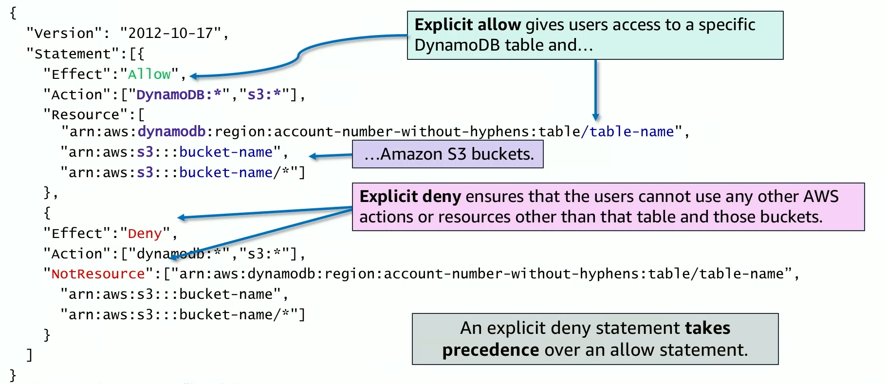
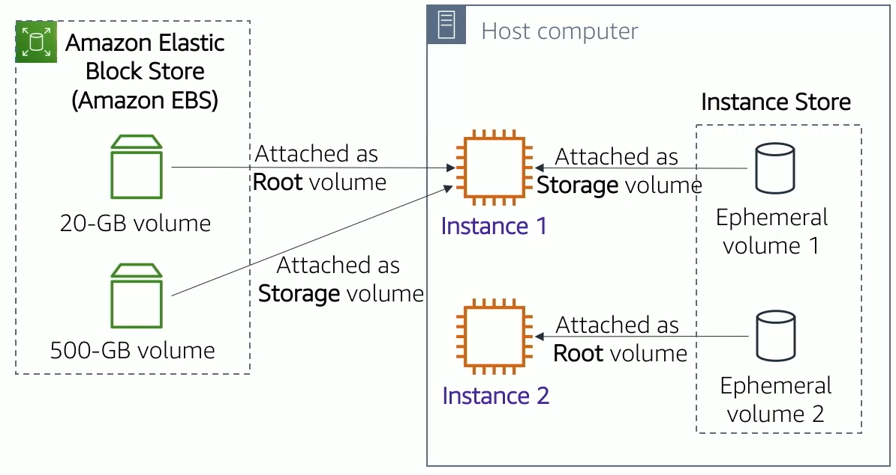
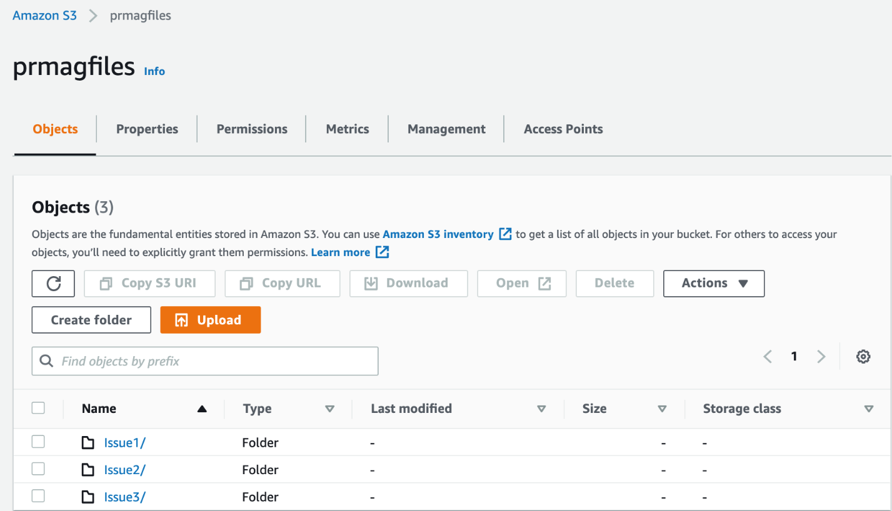
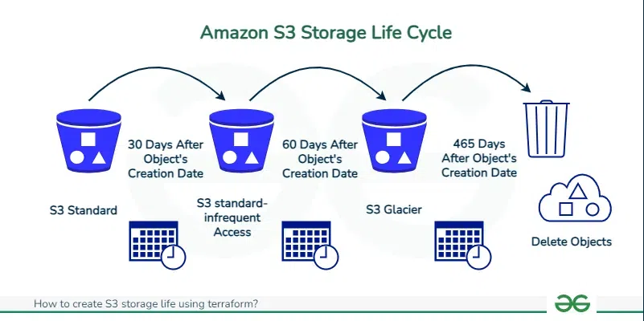
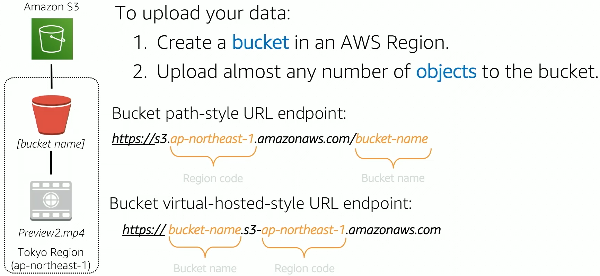
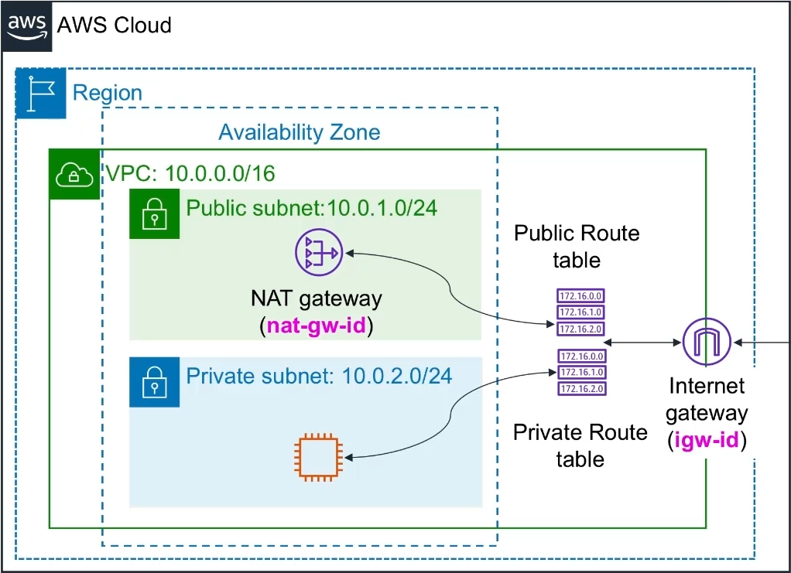
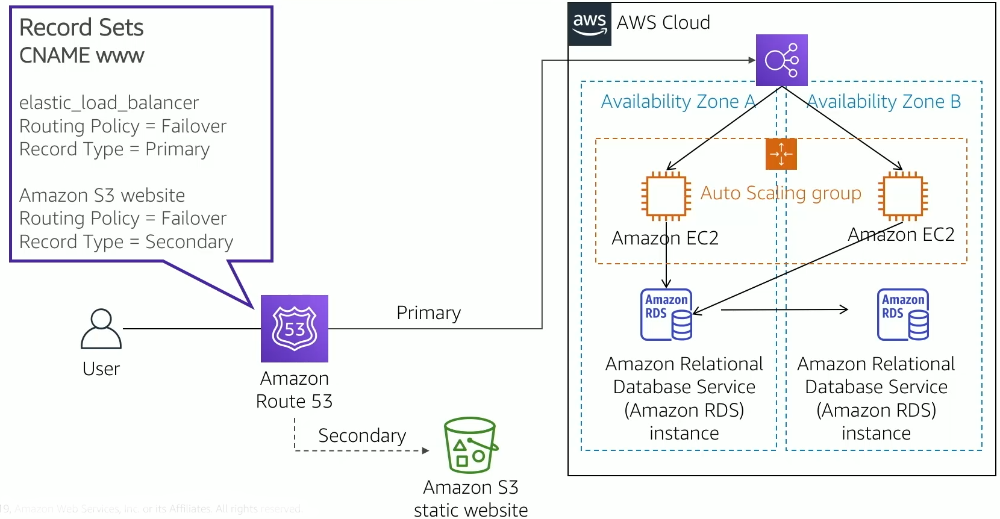
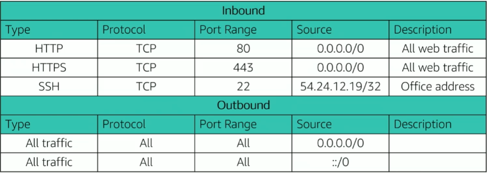
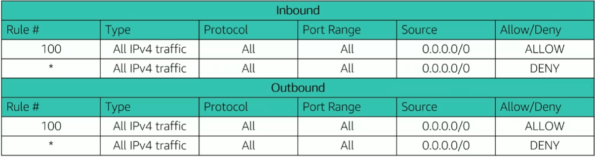

```mermaid
flowchart LR
    Dev["Developer edits main.tf"] --> Commit["Commit & push to GitHub"]
    Commit --> CI["CI/CD pipeline starts"]
    CI --> Init["terraform init"]
    Init --> Plan["terraform plan (show proposed changes)"]
    Plan --> Review["Manual review & approval"]
    Review --> Apply["terraform apply (provision/update resources)"]
    Apply --> State["Update remote state in S3"]
    State --> AWS["AWS infrastructure updated"]

    style Dev fill:#4da6ff,stroke:#003366,stroke-width:2px,color:#ffffff
    style Commit fill:#ffcc66,stroke:#b36b00,stroke-width:2px,color:#000000
    style CI fill:#9966ff,stroke:#4d0099,stroke-width:2px,color:#ffffff
    style Init fill:#ff9933,stroke:#994d00,stroke-width:2px,color:#ffffff
    style Plan fill:#ffcc00,stroke:#996600,stroke-width:2px,color:#000000
    style Review fill:#cccccc,stroke:#666666,stroke-width:2px,color:#000000
    style Apply fill:#33cc33,stroke:#006600,stroke-width:2px,color:#ffffff
    style State fill:#b3d9ff,stroke:#003366,stroke-width:2px,color:#000000
    style AWS fill:#66ccff,stroke:#003366,stroke-width:2px,color:#000000
```

---
marp: true
theme: default
paginate: true
---


# AWS Shallow Dive


---

## Table of Contents

1. [What is Cloud Computing?](#1-what-is-cloud-computing)
   - [Why use Cloud instead of Local Infrastructure?](#why-use-cloud-instead-of-local-infrastructure)
   - [AWS Responsibility Model](#aws-responsibilty-model)
   - [Key AWS Structures](#key-aws-structures-with-arn-examples)
     - [Regions & Availability Zones (AZs)](#regions--availability-zones-azs)
     - [Accounts, “Projects”, and Subscriptions](#accounts-projects-and-subscriptions)
     - [Billing](#billing-how-you-pay)
   - [Amazon Resource Names (ARN)](#arn-amazon-resource-name)

2. [Cloud Service Models](#2-cloud-service-models)
   - [IaaS](#iaas--infrastructure-as-a-service)
   - [PaaS](#paas--platform-as-a-service)
  Dol: [SaaS](#saas--software-as-a-service)

3. [AWS Identity and Access Management (IAM)](#3-aws-identity-and-access-management-iam)
   - [Users](#users)
   - [Root User](#root-user)
   - [Groups](#groups)
   - [Policies](#policies)
   - [Roles](#roles)
   - [Policy Permissions Example](#policy-permissions-example)
   - [Example Use of an IAM Role](#example-use-of-an-iam-role)
   - [Best Practices](#best-practices)

4. [AWS Access Methods](#4-aws-access-methods)
   - [How AWS Access Keys Work](#how-aws-access-keys-work)
   - [How Signing Works](#how-signing-works)
   - [SDK – Software Development Kits](#sdk--software-development-kits)
   - [Terraform – Infrastructure as Code](#terraform-infrastructure-as-code)

5. [AWS Core Services](#5-aws-core-services)
   - [Amazon EC2](#amazon-ec2-elastic-compute-cloud)
     - [Key Attributes](#key-attributes)
     - [Amazon EBS](#amazon-ebs-elastic-block-store)
     - [Example EC2 Instance JSON](#example-ec2-instance-json)
   - [Amazon S3](#amazon-s3-simple-storage-service)
     - [Key Attributes](#key-attributes-1)
     - [How It Works](#how-it-works)
     - [S3 Lifecycle Policies](#s3-lifecycle-policies)
     - [Example Use Cases](#example-use-cases)
   - [VPC – Virtual Private Cloud](#vpc-virtual-private-cloud)
     - [Key Components](#key-components)
     - [NAT Gateway](#nat-gateway)
   - [Route 53](#route-53)
   - [Security Groups](#security-groups)
   - [Network ACLs](#acl-access-control-list)
   - [AWS SSM Documents](#aws-ssm-documents)
   - [AWS CloudTrail](#aws-cloudtrail)
   - [AWS CloudWatch](#aws-cloudwatch)
   - [Key Differences CloudTrail vs CloudWatch](#key-differences-cloudtrail-vs-cloudwatch)
   - [AWS GuardDuty](#aws-guardduty)
   - [AWS KMS](#aws-kms-key-management-service)

6. [Summary](#summary)

---

## 1. What is Cloud Computing?
Cloud computing is the delivery of computing services (servers, storage, databases, networking, software, analytics, intelligence) over the internet (“the cloud”).  
Instead of owning physical servers or data centers, companies rent computing resources from providers like AWS.

---

### Why use Cloud instead of Local Infrastructure?
- **Scalability** – Easily scale up or down as needed.
- **Cost efficiency** – Pay only for what you use (no large upfront hardware costs).
- **Accessibility** – Access from anywhere with internet.
- **Reliability** – Built-in redundancy and failover.
- **Security** – Enterprise-level security measures.
- **Faster deployment** – Launch resources in minutes.

---

### AWS responsibilty model


---

## Key AWS Structures (with ARN examples)

### Regions & Availability Zones (AZs)
- **Region** = a geographic cluster of AWS data centers (e.g., `us-east-1`, `eu-central-1`).
- **Physically**: each Region contains **multiple AZs**; each AZ is an isolated data center or campus with separate power, cooling, and networking.
- **Why it matters**: place workloads near users (low latency) and keep data in-country (compliance). Design for HA by spreading across **≥2 AZs**.

---

### Accounts, “Projects”, and Subscriptions
- **AWS Account** = isolation + billing boundary + IAM scope. Use multiple accounts for envs (prod/stage/dev), teams, or tenants.
- **“Project”** (not an AWS primitive): organize via **tags**, **OUs** (AWS Organizations), and sometimes **separate accounts** per project.
- **“Subscription”** is an **Azure** term. In AWS the closest equivalent is an **Account**.
- **Organizations**: link accounts, apply guardrails (SCPs), and use **Consolidated Billing**.

---

### Billing (how you pay)
- **Pay-as-you-go** for usage (compute hours, GB-months, requests, egress).
- **Discounts**: **Savings Plans/Reserved Instances** for steady workloads.
- **Free Tier** for testing; **Budgets** and **Cost Explorer** to track/alert.
- **Consolidated Billing** rolls up costs across linked accounts.

---

## ARN (Amazon Resource Name)

**What it is**  
A **globally unique identifier** for any AWS resource.

**Generic format**  
arn:partition:service:region:account-id:resource

---

**Field breakdown:**
- **`arn`** – indicates that this is an Amazon Resource Name.
- **`service`** – AWS service namespace (e.g., `ec2`, `s3`, `lambda`, `dynamodb`); in the example, `ec2` is for an EC2 server.
- **`region`** – the geographic location where the resource resides (e.g., `us-west-2`); AWS divides its infrastructure into regions for accessibility and faster performance.
- **`account-id`** – the 12-digit AWS account ID that owns the resource.
- **`resource`** – a service-specific path or unique ID; could represent an EC2 instance, an object in S3, a Lambda function, or a database record.

**Examples:**
arn:aws:ec2:us-west-2:123456789012:instance/i-1234567890abcdef0
arn:aws:s3:::my-bucket/my-object
arn:aws:lambda:us-east-1:123456789012:function:MyFunction
arn:aws:dynamodb:us-east-1:123456789012:table/MyTable

---

## 2. Cloud Service Models

### **IaaS** – Infrastructure as a Service
- Provides virtualized computing resources over the internet.
- Examples: AWS EC2, Amazon VPC.
- You manage: OS, applications, runtime.
- AWS manages: hardware, networking.


---

AWS provides raw infrastructure resources, and you manage the operating systems, networking, and software:
- **Amazon EC2** – Virtual servers you manage.
- **Amazon EBS** – Block storage volumes for EC2 instances.
- **Amazon VPC** – Isolated virtual network environment in AWS.

---

### **PaaS** – Platform as a Service
- Provides platform and environment to build apps without managing infrastructure.
- Examples: AWS Elastic Beanstalk, AWS Lambda.
- You focus on code, AWS handles infrastructure.


---

Services where AWS manages the underlying infrastructure, and you focus on code or application logic:
- **AWS Lambda** – Run code without managing servers (serverless).
- **Amazon RDS** – Managed relational database service.
- **AWS Elastic Beanstalk** – Deploy and manage applications without handling infrastructure.

---

### **SaaS** – Software as a Service
- Ready-to-use software hosted in the cloud.
- Examples: Gmail, Salesforce, AWS WorkMail.
- You use the software; AWS/vendor manages everything.


---

Fully managed applications you can use directly:
- **AWS Trusted Advisor** – Recommendations for cost optimization, performance, and security best practices.
- **AWS Shield** – DDoS protection service.
- **Amazon Chime** – Online meetings, video conferencing, and communications tool.

---

## 3. AWS Identity and Access Management (IAM)

### **Users**
- A person or application that can authenticate and interact with an AWS account using assigned credentials.

---

## **Root User**
- Created when AWS account is first set up.
- Has full access to all resources.
- **Best Practices:** Avoid daily use, enable MFA, create IAM admin users.

---

### **Groups**
- A collection of IAM users that share the same permissions.  
  Commonly used by IT and DevOps teams to simplify permission management.  
  Instead of configuring permissions for each user individually, you can add or remove users from a group that already has the required permissions.

---

### **Policies**
- JSON documents that define **which AWS resources can be accessed** and **the level of access** (e.g., read, write, delete) to each resource.

---

### **Roles**
- A mechanism to grant a set of permissions to be assumed by AWS services, IAM users, or applications.  
  Roles are typically used for temporary access without sharing long-term credentials.


---

### **Policy Permissions Example**



IAM permission policies follow the **implicit deny** principle:  
1. AWS first checks if there’s an explicit “Deny” — if found, access is denied.  
2. If no explicit deny, it checks for an “Allow” — if found, access is granted.  
3. If neither is found, access is denied by default.


---

### **Example Use of an IAM Role**

A common best practice for granting an application the permissions it needs — without exposing credentials — is to attach an IAM role with the necessary policies directly to the compute resource (e.g., an EC2 instance).  

When the application needs to access another AWS resource (for example, an S3 bucket), it **assumes the role** and gains the temporary permissions required.  
This ensures the application can access only the intended resources and never stores permanent credentials.


---

**Best Practices:**
- Assign permissions to groups or roles, not directly to individual users.
- Follow the **principle of least privilege** — grant only the permissions necessary for the task.
- Avoid overly broad permissions; be as specific as possible.
- Use IAM roles for applications and AWS services instead of embedding long-term credentials.

---

## 4. AWS Access Methods
- **Console** – Web-based AWS Management Console.
- **CLI** – Command Line Interface (`aws` commands) uses a public access key (Access key ID) and private Access key.
- **SDKs** – Programming access for different languages.
- **Terraform** – Infrastructure as code for automation.

---

## How AWS Access Keys Work

AWS Access Keys consist of:
- **Access Key ID** (public) – Identifies the IAM user or AWS account (like a username).
- **Secret Access Key** (private) – Used to cryptographically sign requests (like a password).

---

### How They Work
1. **Two Parts**
   - **Access Key ID** (public) – Identifies the AWS account or IAM user making the request.
   - **Secret Access Key** (private) – Used to sign requests cryptographically.

2. **Usage**
   - You send an API/CLI request to AWS with your **Access Key ID** and a **digital signature** generated using your Secret Access Key.
   - AWS verifies the signature to ensure:
     - The request came from someone who owns the Access Key.
     - The request wasn’t altered in transit.
     - The key has the permissions needed (IAM policy check).

3. **Security Rules**
   - **Never** expose the Secret Access Key in code, GitHub, or public places.
   - Rotate keys regularly.
   - Use **IAM roles** with temporary credentials instead of static keys whenever possible.

---

### How Signing Works
1. AWS CLI/SDK builds a **canonical request** (method, path, headers, body hash).
```bash
GET
/

host:example.amazonaws.com
x-amz-date:20250812T120000Z

host;x-amz-date
e3b0c44298fc1c149afbf4c8996fb92427ae41e4649b934ca495991b7852b855
```
2. Creates a **string to sign** (AWS4 algorithm, timestamp, region, service, request hash) think of it of metadata.
```bash
AWS4-HMAC-SHA256
20250812T120000Z
20250812/us-east-1/s3/aws4_request
b1a56c65efb5b33a0cbad04d046b50f429d3e9b771f2f51e8ed5c0c64f9f7d70
```

---

3. Uses the **Secret Access Key** to derive a signing key via multiple HMAC-SHA256 steps:
```bash
kDate    = HMAC("AWS4" + SecretAccessKey, Date)
kRegion  = HMAC(kDate, Region)
kService = HMAC(kRegion, Service)
kSigning = HMAC(kService, "aws4_request")
```
4. Generates a **signature** for that specific request.
```bash
Signature = HMAC(kSigning, StringToSign)
```
5. Sends the Access Key ID + signature in the request headers.
6. AWS verifies the signature and checks IAM permissions.

---

**Key Points:**
- The **Secret Access Key** is never sent over the network.
- Each request has a unique signature tied to that moment in time.
- Use IAM roles instead of hardcoding keys in applications.

---


---

### SDK – (Software Development Kits)

SDKs are libraries provided by cloud vendors like AWS for various programming languages, allowing developers to programmatically provision, configure, and manage AWS environments through scripts and applications.

**Example: Python SDK (boto3)** – List all S3 buckets in the environment:
```python
import boto3

# Create an S3 client (uses credentials from environment, AWS CLI config, or IAM role)
s3 = boto3.client('s3')

# List all buckets
response = s3.list_buckets()

print("Your S3 Buckets:")
for bucket in response['Buckets']:
    print(f" - {bucket['Name']}")
```

SDKs use the Access Key ID (public) and Secret Access Key (private) as listed above - or IAM roles with temporary credentials — to authenticate requests securely.

---

### Terraform (Infrastructure as Code)

Terraform is a widely used tool for automating the provisioning and management of infrastructure using a domain-specific language (HCL – HashiCorp Configuration Language).  
It’s used extensively in organizations to maintain reproducible, version-controlled infrastructure.

---

#### Core Files
- **`main.tf`** – Contains the Terraform code describing which resources to create (e.g., EC2, S3, VPC) and the provider configuration (e.g., AWS).
- **`terraform.tfstate`** – Stores the current state of your infrastructure. Terraform uses it to determine what changes need to be made.  
  Example:  
  If the state file shows two EC2 instances (`ec2-1`, `ec2-2`) and the code defines three (`ec2-1`, `ec2-2`, `ec2-3`), Terraform will **only** create the missing one (`ec2-3`).

---

#### State Storage
- Can be stored **locally** on your machine.
- In production, it’s best to store it **remotely** (e.g., in an S3 bucket with DynamoDB locking) for:
  - Security
  - Collaboration in teams
  - Consistency across environments

---

#### Typical Workflow with GitHub
1. Developer makes infrastructure changes in `main.tf`.
2. Changes are committed and pushed to a GitHub repository.
3. A CI/CD pipeline (e.g., GitHub Actions, Jenkins) runs:
   - **`terraform init`** – Downloads providers and sets up the working directory.
   - **`terraform plan`** – Shows what changes will be made without applying them.
   - **`terraform apply`** – Applies the changes to the infrastructure.
4. Terraform updates the remote state to reflect the current infrastructure.

---

#### Key Terraform Commands
```bash
# Initialize Terraform in the current directory
terraform init

# See what changes will be made without applying them
terraform plan

# Apply the changes (requires confirmation)
terraform apply

# Apply the changes without asking for confirmation
terraform apply -auto-approve

# Destroy all resources defined in the configuration
terraform destroy
```

---



---

[AWS to provisioning with Terraform](https://github.com/ronthesoul/aws-terraform)

Key Takeaways:

- Terraform ensures infrastructure changes are predictable and automated.
- The .tfstate file is critical — treat it as sensitive.
- Using GitHub + remote state + CI/CD allows safe, collaborative infrastructure changes.

---

## 5. AWS Core Services

---

## Amazon EC2 (Elastic Compute Cloud)

Amazon EC2 provides scalable virtual servers in the AWS cloud.  
You can customize an instance based on several attributes:

### Key Attributes
1. **AMI (Amazon Machine Image)** – Defines the OS and pre-installed software.
2. **Instance Type** – Determines CPU, memory, storage, and networking capacity.
3. **Network Settings** – VPC, subnets, and public IP assignment.
4. **IAM Role** – Grants permissions to the instance for AWS service access.
5. **User Data** – Scripts or commands that run on first boot.
6. **Storage Options (EBS/Ephemeral)** – Persistent (EBS) or temporary storage.
7. **Tags** – Key-value pairs for organization.
8. **Security Group** – Virtual firewall controlling inbound/outbound traffic.
9. **Key Pair** – SSH access credentials.

---

### Amazon EBS (Elastic Block Store)
- Persistent block storage for EC2.
- Remains available independently of the instance lifecycle.
- Can be attached, detached, and re-attached to EC2 instances.

**How EC2 & EBS Work Together:**  
An EC2 instance typically boots from an EBS volume, which stores the OS and data. Even if the instance stops, data persists in the EBS volume.

---

### Example EC2 Instance JSON
```json
{
  "ImageId": "ami-0123456789abcdef0",
  "InstanceType": "t2.micro",
  "KeyName": "my-keypair",
  "SubnetId": "subnet-0abc1234def567890",
  "SecurityGroupIds": ["sg-0123abcd4567efgh8"],
  "IamInstanceProfile": {
    "Name": "EC2S3AccessRole"
  },
  "TagSpecifications": [
    {
      "ResourceType": "instance",
      "Tags": [
        {"Key": "Name", "Value": "MyEC2Instance"}
      ]
    }
  ],
  "UserData": "IyEvYmluL2Jhc2gKZWNobyAiSGVsbG8gZnJvbSBVU0VSRGF0YSIgPiAvdmFyL3d3dy9odG1sL2luZGV4Lmh0bWw=",
  "BlockDeviceMappings": [
    {
      "DeviceName": "/dev/xvda",
      "Ebs": {
        "VolumeSize": 8,
        "VolumeType": "gp3",
        "DeleteOnTermination": true
      }
    }
  ],
  "MinCount": 1,
  "MaxCount": 1
}
```



---

## Amazon S3 (Simple Storage Service)

Amazon S3 is AWS’s scalable **object storage** service used to store and retrieve any amount of data from anywhere on the web.



---

### Key Attributes
1. **Buckets**  
   - Top-level containers for objects (files).  
   - Have globally unique names.  
   - Configurable for region, versioning, logging, and encryption.

2. **Objects**  
   - Individual files stored in buckets.  
   - Each object has:
     - Data (the file itself)
     - Metadata (information about the file)
     - A unique key (path/name inside the bucket)

3. **Storage Classes**  
   - Optimize cost and performance based on access patterns.  
   - Examples: Standard, Intelligent-Tiering, Standard-IA, Glacier.

4. **Access Control**  
   - Managed via **Bucket Policies**, **IAM Policies**, and **Access Control Lists (ACLs)**.  
   - Supports fine-grained permissions for users and applications.

5. **Versioning**  
   - Keeps multiple versions of an object to protect against accidental overwrites or deletions.

6. **Data Management**  
   - Lifecycle rules for automatic transition to cheaper storage or deletion.
   - Replication for cross-region or same-region redundancy.

---

### How It Works
- You create a **bucket** in a chosen AWS region.
- Upload files (objects) to the bucket with a unique key.
- Access objects using HTTPS URLs or via the AWS CLI/SDK.
- Integrates with many AWS services for backups, static websites, analytics, and big data processing.

---

### S3 Lifecycle Policies
S3 Lifecycle policies automate the management of objects over time by transitioning them to lower-cost storage classes or deleting them based on rules.  

For example, for hot logs:  
- **Day 0**: Store in **S3 Standard** for frequent access (low latency, high throughput).  
- **After 30 days**: Transition to **S3 Standard-Infrequent Access (IA)** for less frequent but still quick access (lower storage cost).  
- **After 90 days**: Move to **S3 Glacier Instant Retrieval** or **S3 Glacier Flexible Retrieval** for archival (even lower cost, with retrieval times from milliseconds to minutes).  
- **After 180 days**: Optionally delete or transition to **S3 Glacier Deep Archive** for long-term retention (cheapest storage, retrieval in hours).  

This optimizes costs while ensuring data availability based on access patterns.



---

**Example Use Cases:**
- Hosting static websites.
- Storing backups and logs.
- Serving media files to applications.
- Data lakes for analytics.



---

### VPC (Virtual Private Cloud)

A **Virtual Private Cloud** (VPC) is an isolated virtual network within AWS where you can launch and manage AWS resources securely.

**Key Components:**

- **Subnets**  
  - Logical subdivisions of the VPC’s IP address range (CIDR block).  
  - **Public subnets**: Accessible from the internet (via Internet Gateway).  
  - **Private subnets**: No direct internet access.

- **Routing Tables**  
  - Define how traffic is directed within the VPC and to external networks.  
  - Each route specifies a **destination CIDR block** and a **target** (e.g., Internet)

System: **Internet Gateway, NAT Gateway, local).**

- **Network Gateways**  
  - **Internet Gateway (IGW)**: Enables communication between VPC resources and the internet.  
  - **NAT Gateway**: Allows private subnet instances to connect out to the internet without exposing them to inbound traffic.  
  - **VPC Peering / Transit Gateway**: Connects multiple VPCs.

---

**How It Works:**
1. You define a **CIDR block** when creating the VPC.
2. Create **subnets** within that CIDR block to segment resources.
3. Associate **routing tables** with subnets to control traffic flow.
4. Attach appropriate **network gateways** to enable internet access or private connections.
5. Use **security groups** and **network ACLs** to control inbound/outbound traffic at the instance or subnet level.

**Example:**
- VPC CIDR: `10.0.0.0/16`
  - Public Subnet: `10.0.1.0/24` → Route to IGW
  - Private Subnet: `10.0.2.0/24` → Private Route table

  

---

 - **NAT Gateway**

  A NAT Gateway allows resources in a **private subnet** to access the internet or AWS services **outbound**, while blocking **inbound** connections from the internet.

- Placed in a **public subnet** with an Elastic IP.
- Used in the route table of a private subnet for internet-bound traffic.
- Managed by AWS — automatically scales and is highly available within its AZ.
- Commonly used for software updates, API calls, or downloading packages without exposing instances publicly.

---

### **Route 53**

**Amazon Route 53** is AWS’s managed DNS service that can register domains, host DNS records, and route traffic based on-rules.  

- **Public Hosted Zones** – Serve DNS records accessible from the internet.  
- **Private Hosted Zones** – Serve DNS records only to resources within associated VPCs.  

**Routing Policies** – Route 53 can control how DNS queries are answered using different strategies:  
- **Simple Routing** – Returns a single resource for a domain name; best when you have one endpoint.  
- **Weighted Routing** – Splits traffic across multiple resources based on percentages you set (e.g., 70% to one server, 30% to another for A/B testing).  
- **Latency-based Routing** – Sends users to the region with the lowest latency for them, improving performance.  
- **Failover Routing** – Automatically routes traffic to a backup resource if the primary becomes unhealthy.  
- **Geolocation Routing** – Routes traffic based on the user’s location (e.g., send European users to EU servers).  
- **Geoproximity Routing** – Routes traffic based on geographic location and allows biasing towards certain resources.  
- **Multi-value Answer Routing** – Returns multiple healthy resources to improve redundancy.

---

**Health Checks** – Route 53 can monitor the health of endpoints (via HTTP, HTTPS, or TCP checks):  
- If an endpoint fails health checks, Route 53 stops including it in DNS responses.  
- Health checks can be integrated with failover or multi-value routing to ensure users are sent only to healthy resources.  
- You can configure alarms with CloudWatch for visibility when health checks fail. 

**Key Use Cases:**
- Host and manage DNS records like Cloudflare.
- Route internal VPC traffic to private resources via Private Hosted Zones.
- Route internet traffic to AWS or external resources.



---

### **Security groups**
A Security Group is a virtual firewall for controlling inbound and outbound traffic **at the instance level**.
- **Stateful** – If you allow inbound traffic, the return traffic is automatically allowed.
- Rules are based on:
  - Protocol (TCP, UDP, ICMP)
  - Port ranges
  - Source/Destination (IP, CIDR, or other SG)
- Applied directly to AWS resources like EC2 instances or ENIs.
- Best for **resource-level security**.



---

### **ACL (Access Control List)**
A Network ACL is a virtual firewall for controlling inbound and outbound traffic **at the subnet level**.
- **Stateless** – Return traffic must be explicitly allowed in the rules.
- Rules are evaluated in order, from the lowest number to the highest.
- Rules specify:
  - Allow or Deny
  - Protocol
  - Port range
  - Source/Destination CIDR block
- Best for **subnet-level security**.



---

**Key Difference:**  
- **SG**: Instance-level, stateful, simpler rules.  
- **ACL**: Subnet-level, stateless, ordered rules with explicit allow/deny.


---

## AWS SSM Documents

### What are SSM Documents?
SSM (Systems Manager) Documents are JSON or YAML files that define the actions AWS Systems Manager should perform on managed instances or AWS resources.

They can:
- Automate tasks like patching, software installation, or configuration changes.
- Be run **on-demand** or **scheduled**.
- Be **custom** (created by you) or **AWS-provided**.

---

### Executing SSM Documents
1. **On-Demand Execution**  
   - Use `AWS-RunCommand` to run the document instantly on one or more instances.
2. **Scheduled Execution (Associations)**  
   - Attach an SSM Document to an instance or group of instances via an **association**.
   - Runs automatically according to your defined schedule or triggers.
   - Common for recurring tasks like nightly patching or compliance checks.

```yaml
---
schemaVersion: '2.2'
description: "Install Apache Web Server"
mainSteps:
  - action: aws:runCommand
    name: InstallApache
    inputs:
      DocumentName: AWS-RunShellScript
      Parameters:
        commands:
          - sudo yum update -y
          - sudo yum install -y httpd
          - sudo systemctl start httpd
          - sudo systemctl enable httpd
```

---

### **AWS CloudTrail**
- **Purpose:** Records **API calls** and account activity across AWS.
- **What it tracks:** Who did what, when, and from where.
- **Data Source:** Management & data plane events from AWS services.
- **Use Cases:** Auditing, compliance, and security investigations.
- **Example:** Logs when an IAM user creates or deletes an EC2 instance.

---

### **AWS CloudWatch**
- **Purpose:** Monitors **metrics**, collects logs, and sets alarms.
- **What it tracks:** Resource utilization, application logs, and performance data.
- **Data Source:** AWS services, custom metrics, and application logs.
- **Use Cases:** Operational monitoring, alerting, automated scaling.
- **Example:** Sends an alarm if CPU usage on an EC2 instance exceeds 80% for 5 minutes.

---

### **Key Differences CloudTrail VS CloudWatch**

| Feature        | CloudTrail                                | CloudWatch                                 |
|----------------|-------------------------------------------|---------------------------------------------|
| **Main Role**  | Logs & audits AWS API activity            | Monitors performance & collects metrics     |
| **Data Type**  | API call history                          | Metrics, logs, and events                   |
| **Focus**      | **Who** did **what** and **when**          | **How** systems are performing              |
| **Retention**  | Stored in S3 or sent to CloudWatch Logs    | Metrics/logs stored for configurable period |
| **Proactive?** | No – historical logging                   | Yes – can alert in near real-time           |

---

### **AWS GuardDuty**

**Purpose:**  
GuardDuty is a managed threat detection service that continuously monitors AWS accounts, workloads, and data for malicious or unauthorized activity.

**How It Works:**  
GuardDuty analyzes multiple AWS data sources to detect suspicious patterns without deploying any additional security infrastructure. It uses machine learning, anomaly detection, and integrated threat intelligence feeds.

**Data Sources:**  
- **VPC Flow Logs** – Detects unusual network patterns, like traffic from unexpected IP ranges.  
- **CloudTrail Events** – Identifies suspicious AWS API activity, like mass IAM key creation.  
- **DNS Query Logs** – Flags requests to known malicious domains.  
- **EBS Malware Scan** – Detects malware in Amazon EBS volumes (integrated feature).  

---

**Key Features:**  
- Continuous, real-time monitoring.  
- No additional agents or appliances required.  
- Integrates with **CloudWatch Events** for automated responses.  
- Supports multi-account AWS Organizations integration.

**Use Cases:**  
- Detecting compromised IAM credentials.  
- Identifying unauthorized access from unusual locations.  
- Detecting EC2 instances communicating with known malware command-and-control servers.  
- Scanning EBS volumes for malicious files after incidents.

**Example Scenario:**  
If an IAM user normally operates from Israel but suddenly authenticates from Russia and tries to launch multiple EC2 instances, GuardDuty will generate a **High Severity Finding**, which can trigger an automated remediation workflow via Lambda.

**Integration**  
GuardDuty findings can be sent to **AWS Security Hub** for centralized security management or directly to **SIEM tools** for correlation with other logs.

---

### **AWS KMS (Key Management Service)**

**Purpose:**  
AWS KMS is a fully managed service that enables you to create, manage, and control cryptographic keys used to encrypt and decrypt data across AWS services and your applications.

**How It Works:**  
1. **Key Creation:** You create symmetric or asymmetric customer master keys (CMKs) in KMS. These keys are stored securely in hardware security modules (HSMs) managed by AWS.  
2. **Encryption/Decryption:** When encrypting data (e.g., in S3, EBS, or RDS), you use a KMS key. KMS generates a data key, encrypts your data with it, and then encrypts the data key with the CMK. The encrypted data key is stored alongside the encrypted data.  
3. **Key Usage:** To decrypt, KMS uses the CMK to decrypt the data key, which then decrypts the data. This ensures the plaintext data key never leaves KMS.  
4. **Key Management:** KMS handles automatic key rotation, auditing via CloudTrail, and access control via IAM policies. You can also import your own keys or use multi-region keys for redundancy.  
5. **Integration:** Seamlessly integrates with services like S3 (for server-side encryption), EBS volumes, and Lambda. For example, enable SSE-KMS on an S3 bucket to automatically encrypt objects using a KMS key.

**Best Practices:**  
- Use envelope encryption (CMK + data keys) for efficiency.  
- Grant least-privilege access to keys via IAM.  
- Enable key rotation annually for compliance.

**Use Cases:**  
- Encrypting sensitive data in S3 buckets.  
- Securing database backups in RDS.  
- Managing keys for custom applications.

---

## Summary
By understanding these concepts, you'll be able to:
- Recognize AWS core services.
- Understand IAM roles, users, and policies.
- Know how to access AWS securely.
- Apply cloud concepts to SOC workflows.